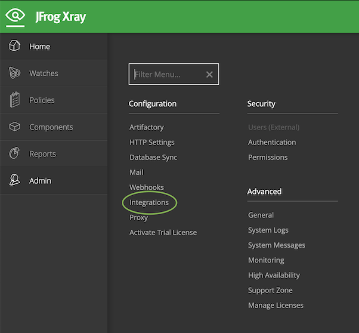
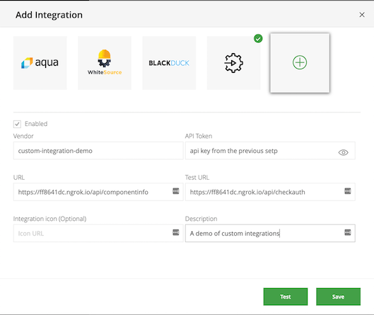
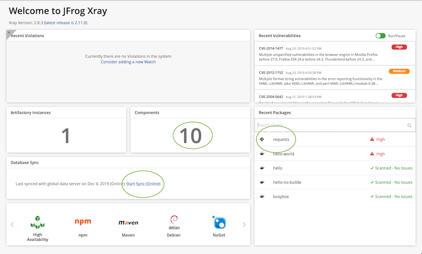
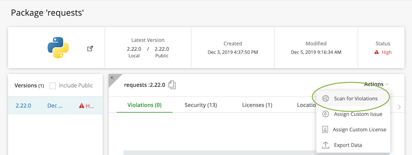

XRay Custom Integration Demo
=====

## What is a custom integration?

XRay can integrate with external services that provide information about vulnerabilities in packages. If a user wants to implement their own such service they can use a custom integration.


## Creating a custom Integration

There are three pieces to set up:

- Artifactory
- Your custom integration server
- XRay

### Artifactory Setup

Update the settings for a repository in Artifactory to be viewable by XRay.


### Running the included demo server

`go run main.go (<api-key>) [<path-to-db-file>]`

If a path to db file is not specified, [db.json](./db.json) will be used. Take note of the api key for the next step.

### Using ngrok to expose your server to the internet

The demo server runs on port 8080, so that's the port to expose.

`ngrok http 8080`

Once ngrok is running, take note of the forwarding urls. These will be provided to XRay when configuring the integration.


### XRay Setup

Open the integrations view from the admin panel in the sidebar.



Click the + icon to add an integration.


Select custom integration.


Configure the integration.

- The base url will be unique to you (e.g. `https://eq8341dc.ngrok.io`).

- Use `/api/componentinfo` and `/api/checkauth` as the endpoint names.

-  Use `custom-integration-demo` as the Vendor.



Test the connection and api key by clicking the "Test" button. You should get a message saying "API key is valid" in the XRay UI.


On the XRay homepage, sync XRay's database. This will allow XRay to pick up any Artifactory repositories configured to have XRay enabled.



When the sync is done, the component count should increase if XRay finds any new components. The new component should also be visible in the right-hand panel.

### Generating a Security Vulnerability

On the details page of the component you want to test, copy the **component id**.


[Depending on the package type](https://www.jfrog.com/confluence/display/XRAY/Xray+REST+API#XrayRESTAPI-ComponentIdentifiers), the component's id should look something like `pypi://requests:2.22.0`. 

At the bottom of [db.json](./db.json), create a new database entry with a fake vulnerability for your package.

In the `component_id` field, **do not include the version**. Semver ranges are supported by the demo server.

```
  {
    "component_id": <component-id-without-version>,
    "licenses": [
      {
        "version": <component-version>,
        "licenses": [
          "Apache 2.0"
        ]
      }
    ],
    "vulnerabilities": [
      {
        "cve": "CVE-0000-0000",
        "version": <component-version>,
        "type": "security",
        "source_id": "0",
        "summary": "A fake vulnerability with my component",
        "description": "A description of the fake vulnerability",
        "cvss_v2": "7.9",
        "url": "http://more.info",
        "publish_date": "2019-11-03T07:30:51.991+00:00",
        "references": [
          "https://example.com"
        ]
      }
    ]
  }

```

For a component with and id of `pypi://requests:2.22.0`, the entry might look like this:

```
  {
    "component_id": "pypi://requests",
    "licenses": [
      {
        "version": "^2.0.0",
        "licenses": [
          "Apache 2.0"
        ]
      }
    ],
    "vulnerabilities": [
      {
        "cve": "CVE-0000-0000",
        "version": "2.22.0",
        ...
      }
    ]
  }
```

In XRay, manually trigger a scan for the component.



After a few seconds, a new security violation should be viewable in the Security tab.

### Testing a component without any vulnerability

Using a new component, make another db entry without any elements in the "vulnerabilities" array.

```
  {
    "component_id": <component-id-without-version>,
    "licenses": [
      {
        "version": <component-version>,
        "licenses": [
          "Apache 2.0"
        ]
      }
    ],
    "vulnerabilities": []
  }


```

Trigger a scan for violations. No new security violations should appear in the UI. A new license should appear in the licenses tab after the first time the scan runs.

### Watching for vulnerabilities

In XRay, it is possible to create **policies** about vulnerabilities that can impose restrictions on an artifact (e.g. blocking the download of an artifact with a sufficiently severy security vulnerability). XRay **watches** can watch repositories for violation of policies and changes to licenses.

To try this out with the demo, [create a watch and a policy](https://www.jfrog.com/confluence/display/XRAY/Watches) and add a new package to one of the repos being watched. If you add a package that matches one of the vulnerabilities in the database, the watch should trigger

### Running Tests

`go test ./`